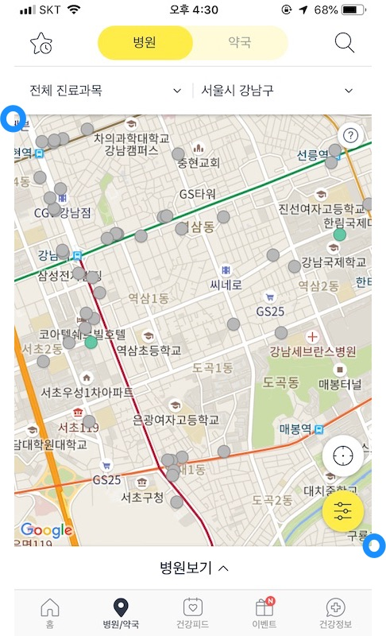
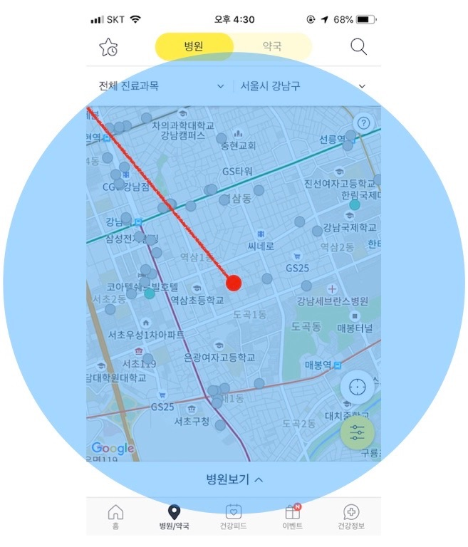

# 레디스를 활용한 병원 찾기 서비스 API 개발

비브로스 제품개발팀 김광호입니다.

현재 똑닥은 병원 접수/예약 서비스를 메인으로 하고 있지만 처음에는 병원 찾기 서비스로 런칭했습니다. 접수/예약을 하기 전 병원부터 찾아야 하니 여전히 병원 찾기 기능은 사용자들이 가장 많이 사용하는 기능 중 하나입니다.

똑닥 최초 런칭시에는 몽고디비의 공간 연산만으로도 충분히 빠른 성능을 제공할 수 있었습니다. 하지만 똑닥의 사용자가 늘어남에 따라 저희가 원하는 정도의 응답속도가 나오지 않았습니다. 물론 성능 향상을 위해 더 좋은 서버를 사용하는 것도 방법이겠지만 비용적으로 효율적이지 않아보였습니다.

그래서 똑닥 병원찾기에 레디스를 활용하였고 저희가 원하는 응답 속도를 달성할 수 있었습니다. 똑닥 서비스에 처음 레디스를 도입한 사례이기도 합니다. (참고로 현재 똑닥은 레디스를 거의 모든 서비스에서 활용 중이고 레디스만으로 운영하는 서비스도 있습니다.)

## 초기 병원 찾기 API - 몽고 디비

똑닥의 메인 데이터베이스는 처음 런칭할 때부터 지금까지 몽고 디비입니다. 하지만 똑닥의 백엔드팀은 **마이크로 서비스를 지향**(중앙화된 요소가 있으나 업무 효율성을 생각해서 유지 중)하고 있어 현재는 몽고디비만을 사용하지는 않습니다. 각 서비스 목적에 맞게 AWS의 DynamoDB와 RDS도 적절히 섞어서 사용하고 있습니다.

몽고 디비만으로 병원 찾기 서비스를 제공했을 때는 [$near](https://docs.mongodb.com/manual/reference/operator/query/near) 연산을 활용했습니다. 

```javascript
db.places.find(
   {
     location:
       { $near :
          {
            $geometry: { type: "Point",  coordinates: [ 127.030256, 37.503824 ] },
            $minDistance: 0,
            $maxDistance: 5000
          }
       }
   }
)
```

쿼리에서 minDistance는 항상 0으로 두었고 maxDistance는 클라이언트에서 보내주는 Bounding Box의 길이로 계산했습니다.

#### Bounding Box

바운딩 박스는 객체를 모두 포함하는 최소 크기의 박스를 말합니다. 똑닥 앱에서 바운딩 박스를 정의하자면 화면에 보여지는 지도 영역을 모두 포함하는 최소 크기의 박스라고 할 수 있을 것 같습니다. 

똑닥 앱에서는 병원 찾기 API를 호출할 때 지도의 왼쪽 상단의 좌표와 오른쪽 하단의 좌표를 넘겨줍니다. 그러면 서버에서는 두 좌표간의 중심점을 계산하고 중심점과 왼쪽 상단의 점과의 거리를 계산합니다. 



그러면 몽고 디비에서는 다음 그림과 같은 범위의 병원을 검색하게 됩니다. 이 경우 화면에 보여줘야할 병원보다 많은 병원이 검색이 된다는 단점은 있습니다.



화면 내에 표시되는 병원만 찾으려면 몽고 디비의 [$geoWithin](https://docs.mongodb.com/manual/reference/operator/query/geoWithin/) 를 사용하면 되지만 이 연산자의 단점은 가까운 순으로 정렬할 수 없다는 점과 지도 범위 밖의 데이터를 불러올 수 없다는 점입니다.

똑닥 내부에서 사용하는 병원 찾기 API는 지도에서도 사용하지만 목록 보기에서도 함께 사용합니다. 목록보기에서는 가까운 순으로 정렬해야하고 무한 스크롤을 지원하기 때문에 지도 범위 밖의 병원도 노출해야 합니다. 

그래서 처음에 API를 구성할 때 $near 연산자를 사용했었습니다.

## 병원 찾기 API - 레디스

레디스도 몽고디비처럼 공간 연산을 지원합니다. 레디스는 메모리 기반의 저장소로 디스크 기반의 몽고 디비보다는 성능이 좋습니다.

병원 찾기 서비스에서 사용하는 레디스 명령어는 다음과 같습니다.

- [GEORADIUS](https://redis.io/commands/georadius)
- [GEOADD](https://redis.io/commands/geoadd)
- [ZREM](https://redis.io/commands/zrem)

명령어에서 저장한 공간 데이터를 삭제하는 명령이 GEODEL이 아닌 ZREM인 이유는 GEOADD로 추가된 데이터는 Sorted Set에 저장되는데요. Sorted Set에 저장된 데이터를 삭제하는 명령은 ZREM입니다. 그래서 따로 GEODEL 같은 명령어를 만들지 않고 ZREM을 사용하도록 가이드하고 있습니다.

#### 레디스 GEOADD

GEOADD는 공간 데이터를 Sorted Set에 추가하는 명령어입니다. 사용하며 주의해야 할 점은 극점(pole)에 아주 가까운 지점은 사용할 수 없습니다. 메르카토르 도법의(EPSG:900913, EPSG:3785, OSGEO:41001) 한계이기 때문이라고 합니다. 유효한 경위도는 다음과 같습니다.

- 위도: -180 ~ 180
- 경도: -85.05112878 ~ 85.05112878

물론 한국에서만 서비스하는 똑닥에서는 이런 제약 조건은 고려 사항도 아니긴 합니다. 

GEOADD는 다음의 형식으로 공간 아이템을 추가하면 됩니다.

```shell
GEOADD 키 위도 경도 이름
GEOADD HOSPITAL 127.0434817 37.5045636 507f1f77bcf86cd799439011
```

저희는 병원에 대한 상세 정보를 조회해야하므로 이름대신 병원 아이디를 입력했습니다. 

#### 레디스 GEORADIUS

GEORADIUS는 중심점에서 지정한 반지름 내의 모든 공간 데이터를 반환합니다. 사용할 수 있는 거리 단위는 다음과 같습니다.

- m: 미터
- km: 킬로미터
- mi: 마일
- ft: 피트

결과 조회시 사용할 수 있는 옵션은 3가지가 있습니다.

- WITHDIST: 중심점과의 거리를 계산해서 반환합니다. 거리의 단위는 지정한 거리 단위로 반환합니다.
- WITHCOORD: 좌표도 함께 반환합니다. 지정하지 않으면 "이름"만 반환합니다.
- WITHHASH: geohash 값도 반환합니다. 레디스는 공간 데이터를 저장할 때 좌표를 geohash 값으로 저장해두는데요. 이 옵션을 사용하면 geohash 값도 함께 반환합니다.

```
GEORADIUS HOSPITAL 127.0434817 37.5045636 200 km WITHDIST
```


## 코드로 살펴보기

코드로 간단하게 병원 정보를 레디스에 넣고 조회하는 기능을 간단하게 구현했습니다. 데이터는 역삼동 소재 의원을 대상으로 다음의 형태로 500건 정도를 준비했습니다.

```json
[
	{
    "position": {
      "lat": 37.5024003,
      "long": 127.0259642
    },
    "title": "1밀리미터성형외과의원"
  },
  {
    "position": {
      "lat": 37.5045463,
      "long": 127.0256122
    },
    "title": "247외과의원"
  }
]
```

redis 라이브러리는 [ioredis](https://github.com/luin/ioredis) 를 사용했습니다.

```typescript
import * as Redis from 'ioredis';
import * as fs from 'fs';

const redis = new Redis({
    host: '127.0.0.1',
    port: 6379
});

const KEY = "DDOCDOC.HOSPITALS";

type HospitalType = { title: string, position: { lat: string, long: string } };

const getHospitals = async () => new Promise(resolve => {
    fs.readFile('./hospitals.json', 'utf8', (err, data) => {
        resolve(JSON.parse(data));
    });
});

const convertRedisParameters = (items: HospitalType[]): number|string[] => items.reduce (
    (previousValue, currentValue) => {
        previousValue.push(parseFloat(currentValue.position.long));
        previousValue.push(parseFloat(currentValue.position.lat));
        previousValue.push(currentValue.title);
        return previousValue;
    },
    []
);

getHospitals()
    .then(convertRedisParameters)
    .then((items:  number|string []) => redis.geoadd(KEY, items))
    .then(() => redis.georadius(KEY, 127.0484885, 37.5047776, 100, 'm'))
    .then(items => {
        console.log('주변 병원: ', items.length, '개')
        console.log(items);
    })
    .catch(err => console.log(err))
    .finally(() => { redis.del(KEY) });

```

로직의 흐름은 1) 병원 정보를 파일에서 가져오고, 2) 레디스 명령어에 맞게 배열 형태로 변경합니다. 그리고 3) 좌표 주변 100m의 병원을 조회합니다. 4) 결과를 출력하고 5) 레디스에 저장한 데이터를 삭제합니다.

**실행 결과**

```shell
주변 병원:  22 개
[ '손호찬피부과의원',
  '코슬립수면의원',
  '땡큐서울이비인후과의원',
  '와이퀸산부인과의원',
  '제이더블유안과의원',
  '퍼펙트치과의원',
  '그대를위한치과의원',
  '노인화산부인과의원',
  '에너지힐링의원',
  '연세백치과의원',
  '연세채움정신건강의학과의원',
  '힐비뇨기과의원',
  '선능필내과의원',
  '임병제안과의원',
  '문기숙산부인과의원',
  '선릉탑비뇨기과의원',
  '정다운이비인후과의원',
  '캘리포니아미형치과의원',
  '플랜미의원',
  '연세자연의원',
  '황우치과의원',
  '듀얼뷰티의원' ]
```